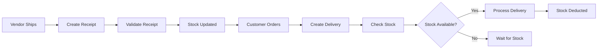
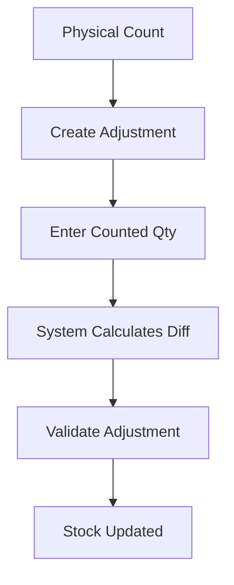

# 📦 StockMaster - Inventory Management System

A modern, full-featured inventory management system built with Next.js 16, React, and Tailwind CSS. StockMaster provides comprehensive tools for managing products, warehouses, stock movements, and operations with an intuitive dark/light mode interface.


---

## ✨ Features

### 🔐 Authentication & User Management
- **Secure Login System** with role-based access control
- **Admin Dashboard** with full system access
- **Staff Management** (Admin Only)
  - Add new staff members
  - Generate secure credentials
  - Activate/Deactivate staff accounts
  - Copy-to-clipboard credential sharing
- **Password Reset** functionality
- **User Registration** with email validation

### 📊 Dashboard & Analytics
- **Real-time KPI Cards**
  - Total Products
  - Low Stock Alerts
  - Total Inventory Value
  - Stock Movement Trends
- **Operation Summary Cards**
  - Quick access to Receipts and Deliveries
  - Status-based filtering
  - Direct navigation to operations
- **Visual Analytics** with charts and graphs

### 📦 Product Management
- **Comprehensive Product Catalog**
  - SKU, Barcode, and Category management
  - Cost and Pricing tracking
  - Multi-location stock tracking
  - Reorder point and quantity settings
- **Product Search & Filtering**
- **Low Stock Monitoring**
- **Bulk Product Operations**

### 🏢 Warehouse Management
- **Multi-Warehouse Support**
  - Warehouse A, Warehouse B, Store B
  - Location-based stock tracking
  - Inter-warehouse transfers
- **Stock by Location** tracking
- **Warehouse-specific operations**

### 🔄 Operations Management

#### 📥 Receipt Operations
- Create purchase orders from vendors
- Track scheduled delivery dates
- Multi-product line support
- Status workflow: Draft → Ready → Done
- Automatic stock updates on validation

#### 📤 Delivery Operations
- **Customer Management**
  - Separate Customer and Delivery Person fields
  - Customer order tracking
- **Stock Validation**
  - Real-time availability checking
  - "Waiting" status for insufficient stock
  - Visual stock warnings
- **Delivery Workflow**
  - Draft → Waiting → Ready → Done
  - Automatic stock deduction

#### 🔀 Internal Transfers
- Inter-warehouse stock transfers
- Source and destination tracking
- Stock availability validation
- Transfer history and audit trail

#### 📝 Stock Adjustments
- Physical inventory counting
- Discrepancy tracking
- Counted vs. System quantity comparison
- Adjustment reasons and notes

### 📜 Move History
- Complete audit trail of all stock movements
- Filter by type: IN, OUT, ADJ
- Search by product, warehouse, or contact
- Date-based filtering
- Movement status tracking

### ⚙️ Settings & Customization
- **Theme Toggle** (Light/Dark Mode)
- **User Profile Management**
- **System Preferences**
- **Category Management**

---

## 🚀 Installation Guide

### Prerequisites

Before you begin, ensure you have the following installed:
- **Node.js** (v18.0.0 or higher)
- **npm** (v9.0.0 or higher) or **yarn**
- **Git** (for cloning the repository)

### Step 1: Clone the Repository

```bash
git clone https://github.com/yourusername/Stock_Master_Gear_5.git
cd Stock_Master_Gear_5/Frontend
```

### Step 2: Install Dependencies

Using npm:
```bash
npm install
```

Or using yarn:
```bash
yarn install
```

### Step 3: Environment Setup

Create a `.env.local` file in the `Frontend` directory (optional for future API integration):

```env
# Future API Configuration
NEXT_PUBLIC_API_URL=http://localhost:3001
NEXT_PUBLIC_APP_NAME=StockMaster
```

### Step 4: Run Development Server

Using npm:
```bash
npm run dev
```

Or using yarn:
```bash
yarn dev
```

The application will be available at `http://localhost:3000`

### Step 5: Build for Production

To create an optimized production build:

```bash
npm run build
npm start
```

Or with yarn:
```bash
yarn build
yarn start
```

---

## 🔑 Default Credentials

### Admin Account
- **Login ID:** `admin123`
- **Password:** `Password@123`
- **Role:** Admin (Full Access)

> ⚠️ **Important:** Change these credentials in production by updating `Frontend/context/AuthContext.js`

---

## 📖 Usage Guide

### Getting Started

1. **Login** with the admin credentials
2. Navigate through the sidebar menu
3. Start by adding **Products** and **Warehouses**
4. Create **Categories** for better organization
5. Begin tracking **Operations** (Receipts, Deliveries, Transfers)

### Creating a Receipt Operation

1. Go to **Operations** → **Receipts**
2. Click **"New Receipt"**
3. Fill in vendor details and scheduled date
4. Add product lines with quantities
5. Save as Draft or mark as Ready
6. Validate to update stock levels

### Processing a Delivery

1. Go to **Operations** → **Deliveries**
2. Click **"New Delivery"**
3. Enter **Customer Name** and **Delivery Person**
4. Select source warehouse
5. Add products to deliver
6. System validates stock availability
7. If stock is available, proceed to Ready/Done
8. If insufficient stock, status shows "Waiting"

### Managing Staff (Admin Only)

1. Go to **Staff Management** (visible only to admins)
2. Click **"Add Staff"**
3. Enter staff name and login ID
4. Generate or enter a password
5. System displays credentials in a modal
6. Copy credentials to share with staff member
7. Manage staff status (Active/Inactive)

### Transferring Stock Between Warehouses

1. Go to **Operations** → **Internal Transfers**
2. Click **"New Transfer"**
3. Select source and destination warehouses
4. Add products and quantities
5. System validates source warehouse stock
6. Complete transfer to update both locations

---

## 🎯 Use Cases

### Retail Store Chain
- **Scenario:** Multi-location retail business with central warehouse
- **Solution:** 
  - Track inventory across all store locations
  - Transfer stock from warehouse to stores
  - Monitor low stock alerts per location
  - Process customer deliveries efficiently

### Wholesale Distribution
- **Scenario:** Wholesale distributor receiving and shipping products
- **Solution:**
  - Manage vendor receipts with purchase orders
  - Track customer deliveries with driver assignments
  - Maintain accurate stock levels
  - Generate movement history reports

### Manufacturing Plant
- **Scenario:** Manufacturing facility with raw materials and finished goods
- **Solution:**
  - Track raw material receipts
  - Monitor work-in-progress inventory
  - Manage finished goods deliveries
  - Perform regular stock adjustments

### E-commerce Business
- **Scenario:** Online retailer with fulfillment center
- **Solution:**
  - Real-time inventory tracking
  - Customer order fulfillment
  - Low stock alerts for reordering
  - Delivery person assignment

---

## 🛠️ Technology Stack

### Frontend
- **Framework:** Next.js 16.0.3 (App Router)
- **UI Library:** React 18
- **Styling:** Tailwind CSS 3.4
- **Icons:** Lucide React
- **State Management:** React Context API

### Development Tools
- **Package Manager:** npm/yarn
- **Code Quality:** ESLint
- **Build Tool:** Turbopack (Next.js)

---

## 📁 Project Structure

```
Frontend/
├── app/
│   ├── layout.js          # Root layout with providers
│   ├── page.js            # Main application entry
│   └── globals.css        # Global styles
├── components/
│   ├── auth/              # Authentication components
│   │   ├── LoginScreen.jsx
│   │   ├── SignUpScreen.jsx
│   │   └── ForgetPasswordScreen.jsx
│   ├── dashboard/         # Dashboard components
│   │   ├── DashboardView.jsx
│   │   ├── KPICard.jsx
│   │   └── OperationSummaryCard.jsx
│   ├── layout/            # Layout components
│   │   ├── Header.jsx
│   │   └── Sidebar.jsx
│   ├── operations/        # Operations management
│   │   ├── OperationsView.jsx
│   │   ├── OperationFormModal.jsx
│   │   ├── ReceiptsListView.jsx
│   │   ├── DeliveriesListView.jsx
│   │   ├── TransfersListView.jsx
│   │   └── AdjustmentsListView.jsx
│   ├── products/          # Product management
│   │   └── ProductsView.jsx
│   ├── staff/             # Staff management (Admin only)
│   │   └── StaffManagementView.jsx
│   ├── history/           # Movement history
│   │   └── MoveHistoryView.jsx
│   └── settings/          # Settings
│       └── SettingsView.jsx
├── context/
│   ├── AuthContext.js     # Authentication state
│   └── StockContext.js    # Stock management state
├── lib/
│   └── utils.js           # Utility functions
└── package.json
```

---

## 🔄 Workflow Examples

### Complete Receipt to Delivery Flow



### Stock Adjustment Process



---

## 🤝 Contributing

Contributions are welcome! Please follow these steps:

1. Fork the repository
2. Create a feature branch (`git checkout -b feature/AmazingFeature`)
3. Commit your changes (`git commit -m 'Add some AmazingFeature'`)
4. Push to the branch (`git push origin feature/AmazingFeature`)
5. Open a Pull Request

---

## 📝 License

This project is licensed under the MIT License - see the [LICENSE](LICENSE) file for details.

---

## 🐛 Known Issues

- None currently reported

---

## 🗺️ Roadmap

- [ ] Backend API integration
- [ ] Database persistence (PostgreSQL/MongoDB)
- [ ] PDF report generation
- [ ] Barcode scanning support
- [ ] Mobile responsive improvements
- [ ] Multi-language support
- [ ] Advanced analytics dashboard
- [ ] Email notifications
- [ ] Export to Excel/CSV
- [ ] Role-based permissions (Staff, Manager, Admin)

---

## 📞 Support

For support, email priyanshuthakare10@gmail.com or open an issue in the GitHub repository.

---

## 👥 Authors

- **Krushna Mohod** - *Initial work* - [Krushnamohod](https://github.com/krushnamohod)
- **Lokesh Chaudhary** - *Initial work* - [lokidass](https://github.com/lokidass)
- **Priyanshu Thakare** - *Initial work* - [YourGitHub](https://github.com/priyanshuthakare)

---

## 🙏 Acknowledgments

- Next.js team for the amazing framework
- Tailwind CSS for the utility-first CSS framework
- Lucide for the beautiful icon set
- The open-source community

---

**Made with ❤️ by the StockMaster Team**